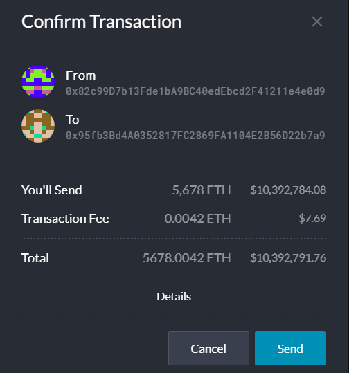
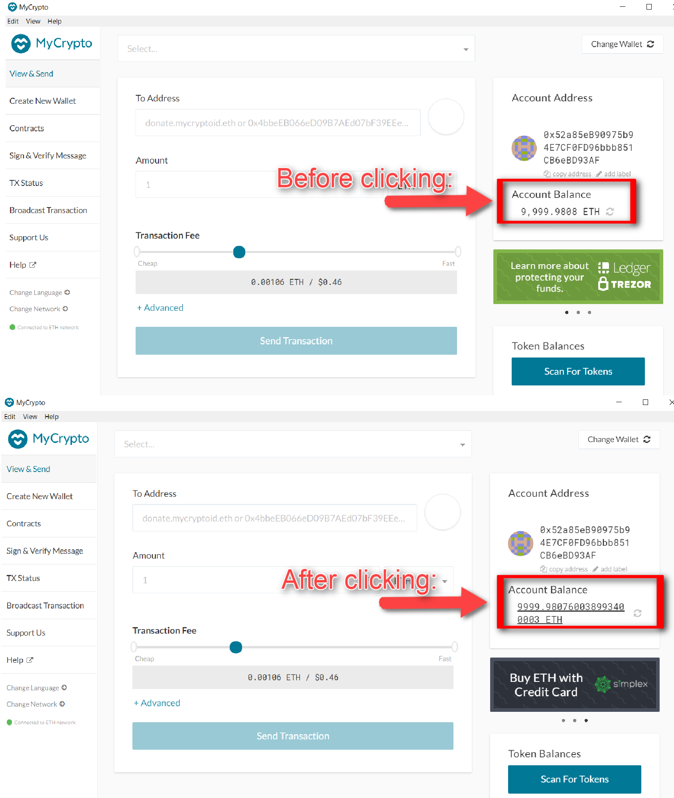

# Team Instructions On How to Set Up & Use a Testnet Blockchain


> Hello Team! I am happy to begin this journey at ZBank and look forward to work with each and every one of you. The README you have just opened will explain how to **set up a private testnet blockchain** for the organization.

## Introduction
___
Setting up a testnet will allow us to explore the potentials of using blockchain technology to benefit us and our customers, without the **real money** involved at first, which will release the pressure of accidentally making transactions that could result in losses for our organization, and also the exciting freedom to experiment! Go wild! Testnets also allows us to work offline.

## Skills/Tools Required
___
* Puppeth, to generate your genesis block.
* Geth, a command-line tool, to create keys, initialize nodes, and connect the nodes together.
* The Clique Proof of Authority algorithm.

## Installalling Dependencies & Environments
___
 In this repository, you will find a folder titled "supplemental" with installation guides to go above and beyond the requirements to follow these instrutions. Copyright Bootcamp LPS. Make sure you cover the below:
   - Ethereum environment
   - Blockchain Tools: make sure you know where you saved this folder locally.
   - MyCrypto Desktop and start a Wallet
   - Assumed that you have terminal/bash and some coding knowledge


## Set Up a Custom Testnet
____
### Creating Nodes
* To set up a custom testnet we will begin by creating nodes, in this example named _node5_ and _node6_ in terminal/bash. Activate the ethereum environment and make sure you are in the directory where we placed the `blockchain-tools` folder locally.

  ```shell
  conda activate ethereum
  cd ~/blockchain-tools/
  ```


* Create your first node, _node5_.

  ```shell
  ./geth --datadir node5 account new
  ```
  
* Save _node5's_ `public address of the key`, a.k.a public key, in a note pad or word file. We will need it later in the process.
* Repeat the process for our second node, _node6_. **Do not forget to also save node6's public key.**


_**Remember, *never* share your mainnet private keys! This is a testnet, so coins have no value here!**_

### Specifying Network - New Genesis
* Run `puppeth` with the below command. Note- make sure you are in the `blockchain-tools` directory.

  ```shell
  ./puppeth
  ```
  
* Specify a network name. I called mine tommy. It's my dog's name and I've been saying it a lot lately. Complete the next steps as follows:

  ```shell
  2 (Configure new genesis)
  1 (Create new genesis from scratch)
  2 (Ethash - proof-of-work)
  Enter Key (default)
  ```


   - Accounts allowed to seal: **paste both nodes public addresses, each in one line of code** (highligted in bright yellow)
   - Pre-funded accounts: **paste both nodes public addresses, each in one line of code** (highligted in bright yellow). There are no block rewards in PoA, so you will need to pre-fund.
   - You can type `no` for pre-funding the pre-compiled accounts (0x1 .. 0xff) with wei to keep the genesis cleaner.
   - For specifying your chain/cnetwork ID, you can choose a combination of numbers or get a random chain id by pressing enter. 
   - To find your random chain id, open your network locally as a txt file (tommy in this case). Save it. You will use it later.
   
  


* We now have our genesis created. We will export it to our previously created network.

  ```shell
  2 Manage existing genesis (we now have a genesis created)
  2 Export genesis configurations
  We will export it to networkname.json, in this case tommy.json (should be in your directory locally since we created the tommy network).
  ctrl C to close puppeth
  ```

     {:height="12px" width="12px"}

### Time to Run! The nodes
#### First Node (node5)
* Open two separate terminal/bash windows to run a node in each one. In the first terminal/bash window we will run _node5_. Don't forget to activate `ethereum environment` and navigate to the `blochain-tools` directory.

  ```shell
  ./geth --datadir nodename init networkname.json
  ./geth --datadir nodename --unlock "SEALER_ONE_ADDRESS" --mine --rpc --allow-insecure-unlock
  ```

* See below with names and keys from our example higlighted in bright yellow.


* Enter your previously set password when asked for it. The password will not appear in the screen as you type it, you must type and press enter hoping you typed it correctly.

* Save the line of code that starts with `enode://`. This is the **SEALER_ONE_ENODE_ADDRESS.** You will need it to run the other node in the other bash/terminal window. SEALER_ONE_ENODE_ADDRESS example: enode://cf123809af495396feb46c25893283427b5da86216e89f91cb48609e00a384f5b85fa5944b1a889f9967863dfc34a155f43d014420064c33f7b3216d9bff2443@127.0.0.1:30303

* Leave _node5_ running in bash/terminal and **do not close the window**

#### Second Node (node6)
* In a separate bash/terminal window, run _node6_. Don't forget to activate ethereum environment and navigate to the blochain-tools directory.

  ```shell
  ./geth --datadir nodename init networkname.json
  ./geth --datadir node2 --unlock "SEALER_TWO_ADDRESS" --mine --port 30304 --bootnodes "enode://SEALER_ONE_ENODE_ADDRESS@127.0.0.1:30303" --ipcdisable --allow-insecure-unlock
  ```

* See below with names and keys from our example higlighted in bright yellow.


* Leave _node5_ running in bash/terminal and **do not close the window**


## Connecting your Nodes to MyCrypto (Drumroll Please!)
____
This is where MyCrypto will come into play. Connect `MyCrypto` to your network by first creating a custom network. 

* Open MyCrypto Desktop. At the bottom left click `Change Network`. Please ignore the selected _mimi_ network. The below screenshot was taken after the next steps you will soon see.The network selected before creating a custom network **will not influence the creation of it**. The world is yours my dear. 

    

* Proceed to select `Add Custom Node` at the bottom left of the following screen:

    


* The following window will pop up. Complete the following information as shwon in the below example:
    - Node Name: Insert any name that you would like here. I chose _mimi_ because I could not come up with anything better lol.
    - Network: Custom
    - Network Name : I like to use the same name as my node name, to be able to recognize which network is used to run a specific node, so I called it _mimi_ as well.
    - Currency: ETH
    - Chain ID: Use the chain ID that you came up with when setting up your nodes. In this example, my chain ID is 55092. This way the network will be connected to your node.
    - URL: copy what is highlighted in the below example. 
    
    
    
* Once all the information is filled out, click on `Save & Use Custom Node` (blue button lower right corner).

* Nice! You have added your custom Network. Now go into 'Change Network' and select your brand new custom network, in this case I selected my _mimi_ custom network (It all makes sense now huh?).

    

* Time to connect those nodes to our wallet! (Please complete _Set Up a Custom Testnet_ steps previously, as we will be using the keys saved during this process). In MyCrypto main screen, selest `Keystore File`. Make sure that you are connected successfully to your custom network when doing this.

    

* In the next screen, select `SELECT WALLET FILE` and search for your first node in your file explorer. In this example this would be "_node5_". Insert your password (created in bash/terminal when setting up the nodes).

    

## Send a Test Transaction
____
* We wil now send a test transaction from _node5_ to _node6_. Copy _node6's_ public key in the `To Adress` section. Make sure to include 0xat the begining if the copied address does not already have it.
* Enter an arbitrary amount of ETH to send
* Under `advanced options`, increase the Gas limit by adding a 0 at the end (although these are test transactions so this is not as relevant).
* Finally, `Send Transaction` by clicking on the bottom blue icon.

    

* The following confirmation screen will pop up with the each nodes adresses, one in the `From` category (sender/_node5_) and the other in the `To` category (receiver/_node6_). Click `Send`.

    


**From Bootcamp Hints:**
* If you aren't seeing any movement in the wallet amounts in MyCrypto after sending/receiving transactions, try the following:
    * Terminate both nodes using `control+C` in the Node1 and Node2 terminal windows.
    * Change networks in MyCrypto to a Testnet such as Kovan.
    * Restart Node1 and Node2 in their terminal windows.
    * Reconnect to your network in MyCrypto.
    * Log into your wallet and refresh the amount.
    
* If that doesn't help make sure you are sending a large enough sum of ETH to see actual movement in the digits. You may have to click on the amount itself to see the full value down to the WEI.

   


* **You will see the below message if the transaction was successful.**


    

**CONGRATULATIONS! YOU HAVE SENT YOUR FIRST TESTNET BLOCKCHAIN TRANSACTION!!**

   


